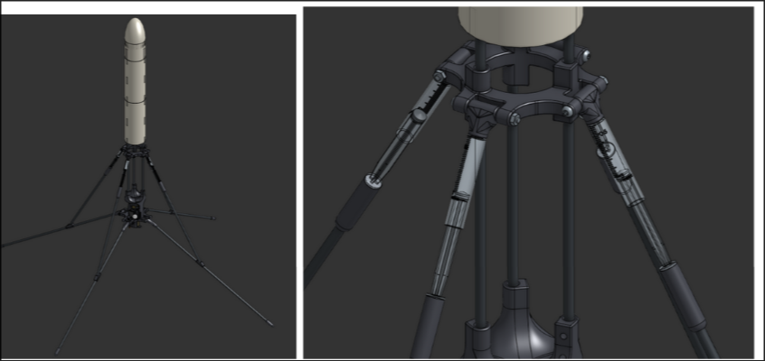

Umit Selvitopu  —  Landing Rocket  —  Logs

178 total hours
148 total cad hours
30 total pcb hours

30 total cad hours after and including May 18
30 total PCB hours after and including May 18
60 total hours after and including May 18

8/22/24 - 4h

I made the basic geometry of the onion-style gimbal.

8/23/24 - 4h

I refined the shape of the gimbal, added curves, and added servos. 

8/24/24 - 2h

I added the rods for the servo

8/26/24 - 2h

I added curves and chamfers to strengthen the parts and prevent bending

8/27/24 - 20min

I started organizing the main assembly of the whole rocket

9/29/24 - 1.5h

I messed up the geometry of the gimbal trying to edit the master sketch, so I decided to split up the master sketch into multiple sketches to make it easier to edit and select the faces from the sketches

10/6/24 - 3h

I realized that if I swapped the direction of the servo on the outermost gimbal slice, it would be easier to integrate. To that end, I made a place for the outer servo rod to connect to. I made that change and also edited the formatting a bit.

10/12/24 - 4h

I changed the innermost gimbal slice to have a better rod connection. I also made a cutout in the outermost gimbal to allow the middle slice maximum range of motion. I also lowered the servos, dropping the placement of the middle gimbal slice rod holder to accommodate this optimization. I also made the servo holder in the middle slice cooler. The assembly broke.

10/13/24 - 3h

I refined the shape of the inner slice rod holder, adjusted the rod shapes, added fillets, and fixed the assembly that was broken. I also added a hole to the top of the inner gimbal.

10/14/24 - 3h

I refined the rod holder of the middle slice and added a channel for the servo. I also added more fillets and the side supports on the outer gimbal slice. 

11/3/24 - 2h

I added material to the bottom side of the middle slice right under the servo and cut out some from the outer slice to prevent bending.

11/7/24 - 1h

Got measurements from a motor I had and started making the reaction wheel.

11/8/24 - 4h

Got more measurements and worked on the reaction wheel.

11/9/24 - 1h

I made the nosecone and put everything into a full assembly. The gimbal and reaction wheel are draggable.

11/11/24 - 2h

I made the reaction wheel stronger, added in the rocket motors, and made a connector piece to connect the two rocket motors.

2/28/25 - 3h

I did some heavy organization, putting everything into folders. I also started version 2 of the gimbal, a more optimized version. Gimbal 1 did 5 degrees in each direction, but I wanted gimbal 2 to do as much as possible. I also wanted gimbal 2 to be more parametric so when I want to change a dimension, it would be easy.

3/4/25 - 1h

I created the top-down outline of the gimbal 2 and created an assembly for it.

3/5/25 - 6h

I started adding onto the outer ring of the gimbal. I also spent a lot of time researching servo motors for the gimbal and found BMS127wv+ to be a good option. It has a 2 us dead bandwidth, can provide a lot of torque, is very fast, and is not too expensive. I imported the servo and its dimensions. I couldn't find the servo arm, so I decided to leave it until the servo is bought to model it myself. I also added a table of values to easily change major dimensions and provide a more parametric setup.

3/6/25 - 6h

Ok, this was overkill, but using the table and wanted angle of max rotation, I created a parametric area box that showed the maximum reach of the gimbal. I made this because I wanted to model the rest off of the extension of the inside gimbal and prevent it from overlapping while maximizing the limited space. I also added to the outer ring of the gimbal. 

3/7/25 - 3.5h

I added the outer ring servo and the place where its rod would connect to. I optimized it by being close to but not touching the extension area of the inner ring of the gimbal. 

3/12/25 - 5h

I changed the holder for the outer ring servo and created the holder for the middle ring servo. Also created the bearing holes, created an indent to have the middle and outer ring not overlap, and placed both servos in the right places. 

3/13/25 - 4h

I added what I guessed to be the shape of the servo arm; the dimensions are derived from a horn I found on Amazon.

3/14/25 - 1h

Worked on the incline in between the servos and added some fillets/chamfers.

3/25/25 - 4h

I decided to attach the PCB directly to the gimbal, so I extended the outer ring up and connected it to a flat place. I added a place for the wires to go through. In addition, I added holes to attach it to the cardboard airframe. A rocket motor is also added, and the middle ring of the gimbal has an extra addition to hold the bearing in more securely. 

4/17/25 - 5h

I added A PLETHORA OF 1mm FILLETS and chamfers, which produced a lot of errors that I had to fix.

4/20/25 - 4h

I added EVEN MORE FILLETS, as well as a detachable flight computer mount. More fillets inside the wiring path and under the servo of the middle ring.

4/22/25 - 3h

Added more fillets, as well as a rod added to make sure it doesn't go over the 3in max diameter. More rounding on the middle ring for strength. 

4/23/25 - 1h

Adjusted hole sizes and optimized some measurements.

4/24/25 - 1.5h

Changed some fillet dimensions and added some fillets.

4/25/25 - 30min

Edited some fillets

4/28/25 - 2h

Edited some more fillets and added face blends

4/29/25 - 1h

Even more fillet editing

4/30/25 - 4h

Optimized some more on the inner and middle rings. Broke the assembly. Started the clamper, which is a thrust reversal system that will block exhaust jets to throttle the solid rocket motors.

5/1/25 - 4h

Added some more optimization by cutting out another hole on the inner ring and more fillets. Continued designing the clamper as well

5/6/25 - 2h

Added holes, screws, and bearings.

5/7/25 - 2h

Added inlet to prevent overlap, cutout to make servo able to go in, and more optimization changes.

5/8/25 - 3h

Decided to switch to a rod format, added rod placement holes for the fuselage, merged the tvc system and flight computer mount, removed unnecessary holes.

5/9/25 - 1h

Added support rods to hold the fuselage

5/14/25 - 1h

Added that channel for the wires and adjusted some fillets.

5/15/25 - 5h

Completely scrapped the old reaction wheel and made a new one, this time more optimized and accommodated to the rod system. It is weighed down with a number of screws

5/16/25 - 4h

Added a reaction wheel motor, started the master height scratch for basically all heights of the rocket, and created the first of the snap-on outside 3D-printed parts.

5/17/25 - 4h

Played with the aesthetics, created the shape of the nose cone, and added the shell part to most of the rocket.

5/18/25 - 30min

More adjustments to colors and materials.

5/22/25 - 45min

Started landing leg sketch; started the tube for the bottom part.

5/24/25 - 2h

Organized files and experimented with different style set screws from mcmastercarr; decided on these shorter ones.

5/25/25 - 4h

Designed the landing leg system, incorporating 3D-printed pieces at the ends of the rods for hinges, additions to the outer TVC ring, and the middle of the vertical body rod. Changed to polymaker LW PLA black color. 

5/27/25 - 20min

Fixed the bend angle of the landing legs.

5/30/25 - 10min

Changed shell color to match Polymaker LW PLA white.

6/16/25 - 5h

Added McMaster-Carr syringes as dampers to the landing legs. I also added a triangle-shaped stopper to the bottom legs and a rounded end to it.

6/17/25 - 5h

I made the outer legs extend further out to prevent overlap. This was particularly annoying because of the sheer amount of fillets I had to experiment with and add to get it to look good and have structural integrity. I added a servo to the 3dp part on the middle of the body to deploy the landing legs. 

6/18/25 - 5h

I created the shell parts for the full length of the rocket, cutting out holes where the deployment servo is and the other features. I modeled it so that there were no unnecessary gaps or inconsistencies.

7/1/25 - 3h

I added these stoppers. These took some time to get right, as mirroring/rotational patterning didn't work for this addition. I also boolean cut out some overlaps in the shell pieces.

7/8/25 - 1h

Despite it being less aerodynamic like this, I made the nose cone pointy for aesthetic purposes.

7/12/25 - 30h

I made this flight computer for the final project for a CS class and independent CS study at my school. 7/12/25 is the submission date. I worked on it in class and out of class. I created the schematic and the PCB, although I still need to refine some aspects of both. Reading though the datasheets and selecting the parts took a decent amount of time.

7/18/25 - 3h

Added cutouts for the rubber band to go through and connection points to connect.

