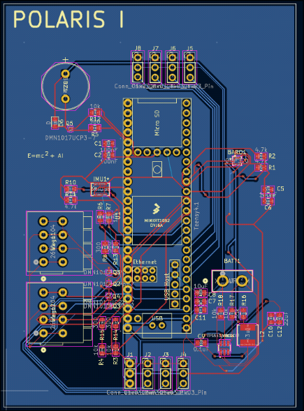
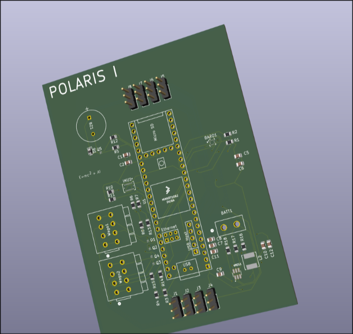
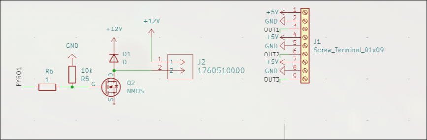

# Day 1 May 22
Before I work on Polaris Mk. 2, the flight computer on the actual rocket, I want to create the groundwork for this project by first writing a simpler flight computer so that I can better plan for this one. I initialized a PlatformIO project and imported the necessary libraries. I started out by removing unnecessary code from main.cpp. Then, I imported the BMP390 Barometer and BMI088 IMU. These two sensors will be used to find the position, velocity, and orientation of the rocket, which is important for nearly every maneuver. Of course, sensors aren't perfect so I'll have to implement something called a Kalman filter later on. I finished a very primitive version of a sensor handler class. Total time spent: 1hr
# Day 2 May 24
The first thing I did today was finish up implementing the barometer so that I could measure altitude. This also requires sea level atmospheric pressure to calculate, which varies from place to place. I decided to have it stored dynamically rather than hardcoded. A pyro channel is a pin meant to ignite a pyrotechnic device, which usually require higher voltages. I created a PyroChannel class that can fire a pyro channel for some duration, which can be used for things like parachute deployment or a second stage. I researched the Arduino SD library so that I could implement an SD card class for logging information, like sensor readings. Also, I realized that I should be storing the values of the sensors each cycle rather than directly getting them from the sensors because its more efficient, so I switched to that. Total time spent: 2.5 hrs
# Day 3 May 25
One of the bigger changes I made today was completely overhauling the SDCard class into the Logger class, which is now capable of organizing logs, along with other capabilities. I added header guards to Pyro.h to prevent any redefinition errors because I forgot to add them yesterday. I also realized that I forgot to license my work, so I did so under the MIT license. I also added a class to handle keeping track of time, which offers utils like last cycle time and elapsed time. TIme spent: 1.5 hrs
# Day 4 May 26
This was the day when I finally implemented the Kalman filter. So, when you try to use sensors, they will always have some amount of noise which can give you innaccurate readings. The goal of the kalman filter is to minimize this noise as much as possible to create the most accurate guess of the rocket's state as possible. I implemented this by using the C++ Eigen library for linear algebra and following the kalman filter equations. I derived my own state transisiton matrix, which essentially integrated acceleration and velocity. I decided not to kalman filter my gyros because I thought that it would be uneccesary for such a short flight and would increase cycle time. Then, I merged this branch into main. Total time spent: 4 hrs
# Day 5 May 27
Today I began testing for my kalman filter. I used my statesim project, which modeled kinematics and sensor noise, to test this. I imported my kalman filter and deps, then I learned and installed matplotplusplus to graph the information. Immediately, I found that my kalman filter did not function correctly and outputted nan, which I fixed by removing some zeroes from the covariant matrices. Next, the kalman filter was off by orders of magnitude, which was the result of an upside-down state transition matrix. Finally, I managed to get it to work at just over 50% reduced noise compared to raw sensor data.

img here

exaggerated img here

Total time spent: 6 hrs
# Day 6 May 28
Today I learned and tested a complimentary filter, which was difficult to tune. It ended up being around 60% the effectiveness of a kalman filter. It runs more efficiently with less instructions to the MPU, but I have a teensy 4.1 so it won't matter. I'll stick to the kalman filter because its simply more effective and I can handle the extra strain.

# Day 7 May 30
However, when I ran the filter for 10000 cycles, things started to break down. I first switched the filter to using doubles instead of floats, which decreased noise by 20%. Then, I set dt = 0.005 to simulate real cycle times. This brought the kalman filter back to normal. I set the filter to run for 1000 cycles with cycle time 5ms, and got this result:

The kalman filter was ten times better than raw sensor data. Since the noise has actually been extremely exaggerated this whole time, and I still managed to get the kalman filter to +- 3 cm, this will be more than enough during flight.
Total time spent: 1hr
# Day 8 May 31
Today I learned KiCAD and started writing the schematics for the Polaris II flight computer that will be used for this rocket. It has 3 pyro channels, 2 BMI088 IMUs, and a BMP390 Barometer. The pyro channels will be used to fire ignitors for tasks like stage separation and deploying the landing legs. I chose the BMI088 because of its low cost, high precision, and its ability to handle impacts. Although I considered the BMI270 for its extremely low power consumption, the difference was negligible in my case because I am using nice LiPo batteries which is more than enough. The BMP390 was the most precise barometer I could find for this project, with its altimeter being +- 0.1m. This is amazing, and will be further improved when coupled with my kalman filter. Today however, I mainly worked on learning how to use KiCad and importing the necessary libraries. I also made the schematics for the BMI088

I also labeled some pins for the MPU

# Day 9 June 01
Today, I didn't work much because of excessive homework. However, I did do a lot of research about pyrotechnic channels and looked for nice screw terminals. Here's my progress today:

I mostly analyzed other schematics to learn more about best practice. The diode is to help protect against things like reverse polarity. I used an N-MOSFET to push 12v into a screw terminal, which will be used to activate any pyrotechnic devices. I used a 10,000 ohm resistor which will make it much safer. I also set up some stuff for general output stuff which will be used to run the 5 servos we're using.
