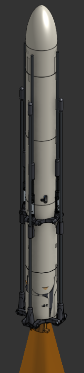

# Day 1 May 22
Before I work on Polaris Mk. 2, the flight computer on the actual rocket, I want to create the groundwork for this project by first writing a simpler flight computer so that I can better plan for this one. I initialized a PlatformIO project and imported the necessary libraries. I started out by removing unnecessary code from main.cpp. Then, I imported the BMP390 Barometer and BMI088 IMU. These two sensors will be used to find the position, velocity, and orientation of the rocket, which is important for nearly every maneuver. Of course, sensors aren't perfect so I'll have to implement something called a Kalman filter later on. I finished a very primitive version of a sensor handler class. Total time spent: 1hr
# Day 2 May 24
The first thing I did today was finish up implementing the barometer so that I could measure altitude. This also requires sea level atmospheric pressure to calculate, which varies from place to place. I decided to have it stored dynamically rather than hardcoded. A pyro channel is a pin meant to ignite a pyrotechnic device, which usually require higher voltages. I created a PyroChannel class that can fire a pyro channel for some duration, which can be used for things like parachute deployment or a second stage. I researched the Arduino SD library so that I could implement an SD card class for logging information, like sensor readings. Also, I realized that I should be storing the values of the sensors each cycle rather than directly getting them from the sensors because its more efficient, so I switched to that. Total time spent: 2.5 hrs
# Day 3 May 25
One of the bigger changes I made today was completely overhauling the SDCard class into the Logger class, which is now capable of organizing logs, along with other capabilities. I added header guards to Pyro.h to prevent any redefinition errors because I forgot to add them yesterday. I also realized that I forgot to license my work, so I did so under the MIT license. I also added a class to handle keeping track of time, which offers utils like last cycle time and elapsed time. TIme spent: 1.5 hrs
# Day 4 May 26
This was the day when I finally implemented the Kalman filter. So, when you try to use sensors, they will always have some amount of noise which can give you innaccurate readings. The goal of the kalman filter is to minimize this noise as much as possible to create the most accurate guess of the rocket's state as possible. I implemented this by using the C++ Eigen library for linear algebra and following the kalman filter equations. I derived my own state transisiton matrix, which essentially integrated acceleration and velocity. I decided not to kalman filter my gyros because I thought that it would be uneccesary for such a short flight and would increase cycle time. Then, I merged this branch into main. Total time spent: 4 hrs
# Day 5 May 27
Today I began testing for my kalman filter. I used my statesim project, which modeled kinematics and sensor noise, to test this. I imported my kalman filter and deps, then I learned and installed matplotplusplus to graph the information. Immediately, I found that my kalman filter did not function correctly and outputted nan, which I fixed by removing some zeroes from the covariant matrices. Next, the kalman filter was off by orders of magnitude, which was the result of an upside-down state transition matrix. Finally, I managed to get it to work at just over 50% reduced noise compared to raw sensor data.

img here

exaggerated img here

Total time spent: 6 hrs
# Day 6 May 28
Today I learned and tested a complimentary filter, which was difficult to tune. It ended up being around 60% the effectiveness of a kalman filter. It runs more efficiently with less instructions to the MPU, but I have a teensy 4.1 so it won't matter. I'll stick to the kalman filter because its simply more effective and I can handle the extra strain.

# Day 7 May 30
However, when I ran the filter for 10000 cycles, things started to break down. I first switched the filter to using doubles instead of floats, which decreased noise by 20%. Then, I set dt = 0.005 to simulate real cycle times. This brought the kalman filter back to normal. I set the filter to run for 1000 cycles with cycle time 5ms, and got this result:

The kalman filter was ten times better than raw sensor data. Since the noise has actually been extremely exaggerated this whole time, and I still managed to get the kalman filter to +- 3 cm, this will be more than enough during flight.
Total time spent: 1hr
# Day 8 May 31
Today I learned KiCAD and started writing the schematics for the Polaris II flight computer that will be used for this rocket. It has 3 pyro channels, 2 BMI088 IMUs, and a BMP390 Barometer. The pyro channels will be used to fire ignitors for tasks like stage separation and deploying the landing legs. I chose the BMI088 because of its low cost, high precision, and its ability to handle impacts. Although I considered the BMI270 for its extremely low power consumption, the difference was negligible in my case because I am using nice LiPo batteries which is more than enough. The BMP390 was the most precise barometer I could find for this project, with its altimeter being +- 0.1m. This is amazing, and will be further improved when coupled with my kalman filter. Today however, I mainly worked on learning how to use KiCad and importing the necessary libraries. I also made the schematics for the BMI088

I also labeled some pins for the MPU

# Day 9 June 01
Today, I didn't work much because of excessive homework. However, I did do a lot of research about pyrotechnic channels and looked for nice screw terminals. Here's my progress today:

I mostly analyzed other schematics to learn more about best practice. The diode is to help protect against things like reverse polarity. I used an N-MOSFET to push 12v into a screw terminal, which will be used to activate any pyrotechnic devices. I used a 10,000 ohm resistor which will make it much safer. I also set up some stuff for general output stuff which will be used to run the 5 servos we're using.

# Day 10 June 02
The first thing I did was attempt to draw the schematics for the battery.

It uses a buck converter to convert 12V to 5V. I used a Schottky diode to help protect against reverse polarity. It will probably cause some amount of voltage drop, and I'm unsure at the current moment what the consequences of that will be. That's it for the battery. I then implemented an LED which is self explanatory:

On the bottom is a piezo buzzer(?) and it is controlled using an N MOSFET because it needs 5v instead of the supplied 3v.
Time spent: 2hr

# June 07/08/09 (Offline Work)
These two weeks, I am between studying rigorously for finals and relaxing for the first week of summer break. However, I did do some calculations during this time. I know that mass will be lost over time as fuel burns, and it wont be linear. I assume that the thrust curve of a rocket motor corresponds to mass lost over time roughly, so I derived approximation formulas, first linearly. I used multivariable optimization to do so, and moved to nth degree polynomials. It was around this time that I became aware of Runge's phenomenon, but I'll consider that later. If I can approximate the curve well, then this rocket will have more accurate information.
Time spent: 5hr

# Day 11, June 20
I added a state detection system which can detect apogee, launch, and landing. It does so by storing the filtered velocity and comparing it this certain thresholds to get an idea of the true velocity. If the velocity is suddenly negative, that means that its falling and has theefore just passed its apogee. Likewise, if it suddenly spikes upwards, then it has launched. If it is suddenly close to zero, then it has landed. It checks this every cycle to deterine the state of the rocket with a few ms of latency.

Time Spent: 2 hr
# Day 12, 13, 14, June 21, 23, 24 (Research Days)
I spent a significant amount of time away from the codebase and instead researching real time operating systems. Polaris I does not use an RTOS, and instead employs a super loop, where all necessary functions are called each cycle

A scheduler is much more sophisticated than this. While a super loop can get held up in a sort of traffic, namely less important tasks taking a long time to execute and blocking crucial tasks, schedulers carefully manages task execution and crucially allows for multitasking. However, a scheduler is much more complex than a super loop and has some overhead. I may not even have to time to implement a full scheduler so I will continue working on other subsystems and see what opportunity I have. One of my greatest concerns however, is that of logging. Apparently logging can take a significant amount of time and this could block or delay things like TVC or the kalman filter from working in time, and could cause performance issues without some sort of scheduler.

Time spent: 5-10 Hours

# Day 15 June 26
I spent most of today looking through my code and for errors. One particular bug that I had known about was one with the logger, where I would log important events and sensor information together in one file, which is a bad idea if you're trying to graph anything. I split the logging into two simultaneous files. This may raise some performance concerns, but we'll deal with those ones the flight computer is actually built.

Also, I added a way to get the full state vector in one method call directly from the kalman filter which could be useful for slightly faster execution times for updating flight computer information.
Time Spent: 1.5hr
# Day 16 June 27
I added a simple Motor class in preparation for a mass tracking class. I planned out a new class that would track the mass of the rocket over time, as fuel is burnt and parts are jettisoned. THe motor class is a significant part of this, as it tracks the propellant mass over time and more useful information about the rocket.
Time Spent: 1hr
# Day 17 June 28
I added a significant amount of logic to the Motor class such that it is entirely operational. I added further information that is handled by the class, such as whether or not it has been jettisoned. Propellant burn rate and getter functions were also added today. I made changes to the flight computer's handling of rocket state information too.
Time spent: 1hr
# Day 18, July 1
The first thing I did was clean up the kalman filter, as it had redundant and dead code that could be removed for faster execution time. I also implemented logic for the MassTracker class. I handles both rocket motors which will be used for ascent and landing, and carefully tracks the mass of each one. To save computation time, I decided to assume a constant mass flow rate instead of utilizing the calculations I did last month. I fixed some typos in the logger, and changes the Motor's update function to return boolean values, inspired by Java's standard libraries. This change gives information on whether or not the rocket has burned out.
Time spent: 2hr
# Day 19 July 2
Today I tried to make a scheduler. It will split tasks into small chunks and alternate quickly between working on each task. I added a lot of ways to rearrange the order of tasks. Tasks are currently stored in a vector, and I added ways to add, remove, set, swap, etc. tasks. Their order in the vector denotes their priority. This will hopefully do a lot against blocking tasks like logging, which is low priority. Another important thing I set up was the Task class which contains an execution interval, a function, and a start delay. These determine when and how often the task executes in the scheduler.
Time spent: 1.5hr
# Day 20 July 3
I continued to work on the scheduler, and added more logic and implemented a lot of the utility and getter functions, particularly surrounding the task vector. I set up constructors for the new classes and realized I was on the wrong git branch. I subsequently merged everything over to main.
Time spent: 1hr
# Day 21 July 4
I added comments to my code and added checks to ensure that all of the information in the scheduler was up to date, as certain changes to task priority could mess that up.
TIme spent: 30m
# Day 22 July 5
I realized that the scheduler would be too complex to fit into this project in time so I move everything to the scheduler branch and switched the main branch back to a super loop.
Time spent:20m
# Day 23 July 6
Today I reviewed the kind of information that I would require post-flight for analysis. I will log acceleration, velocity, position, roll, pitch, and yaw, as well as time
I implemented these into the logger instead of the placeholder values and added proper functionality, which will allow for this to be properly graphed
Time spent: 10m
# Day 24 July 7
To track orientation, one must add it up over time. I have previously thought this would be as trivial as at + v, but I realized that it's a bit more complicated than this. I have 3 options: matrix representation, euler angles, or quaternions. Euler angles are simple but have gimbal lock, and quaternions are computationally lighter than rotation matrices, so I went with quternions. First, I read up on quaternion integration, as that would be how I add angles. I added a Quaternion class and defined multiplication, scaling, and addition. Tomorrow, I will add quaternion integration.
Time spent: 2.5h
# Day 25 July 9
I first added vectors. This is generally useful because angular velocity can be represented as vectors, and there is a vector component of each quaternion. I only defined addition, subtraction, scaling, and dot product, as well as norm/magnitude. These are the most fundemental operations that I need for this class to be useful in the context of rocketry.

I then added quaternion integration. More specifically, I defined an exponential mapping. I also added quaternion normalization and magnitude. the exp of a quaternion is vital for integrating it optimally without numerical errors. I also looked into taylor expansion. The taylor series is a method in calculus for expanding transcedental functions into simple series, and can be used to represent trigonometric functions like sine and cosine. For smaller angles, I might be able to get away with a simple taylor expansion with a few terms to save on computation time. This stayed on paper, but I sriously may implement this later. It would decrease accuracy but increase computation time.

Time spent: 2.5hr
# Day 26 July 10
Today I implemented the previous mathematical framework I had just created using the new RotationHandler class. The main part of this class is that it integrates quaternions using the formula

 (exp(0.5angVel dt) Q)

 The RotationHandler also takes gyro values directly from the sensors as there's no real need for a kalman filter at these scales of operation time. Drift wont be too significant, hopefully. I also made a quick function to convert cartesian angles to quaternions if needed.
 I also found a potential memory leak, so I fixed that too.
 Time Spent: 1hr

 # Day 27 July 12
 First thing I did was add the rotation handler to the flight computer, so orientation is now being actively tracked. I then, based on the previous scheduler I made, created a new kind of tool for handling tasks. It cycled between doing different tasks, completing one on one cycle and the other on the next in a sort of cycle. This was the TaskCycler class and it helped spread out logging into two different parts that would each take up less time per cycle. This means that important things like rocket controls will be allowed to do their jobs in time. I also added much of the old functionality of the scheduler such that this TaskCycler is very easily configurable in the list of tasks.
 Time Spent: 1.5hr
 # Days 28-29, July 15/16
 I worked a lot of planning and the PCB. I redid the schematics for both of the sensors, redid the pyro channels, and switched to a new converter. I readded LEDs and a buzzer. I also switched to a real MOSFET. I also switched from screw terminals to WAGOs. The electronic schematics were essentially overhauled.
 

The rocket will of course have propulsive landing. To do this, I will have thrust reversers that can essentially cut off thrust on demand. This is how I will throttle a solid rocket motor. However, few materials can survive that kind of environment. For a while, that material has been graphite. Although it is abrasive and soft, it can survive extreme temperatures. Recently however, a new material has come up: high temperature reinforced aerogel. This can survive well above the necessary temperatures and advertises that it can be used in high stress environments too, like industrial furnaces. The specific product is SHT1300. Aerogel has excellent thermal shock resistance and low conductivity from my research, so this would be idea. I thoroughly researched this new material, and came to the conclusion that although it is an excellent insulator and a solid option, the short burn time could actually be endured by something like stainless steel 310. It has good thermal shock resistance meaning it might not crack under the high temperatures. Furthermore, I could easily apply a thick layer of ablative coating to help protect it. If I managed to get stainless steel 310 plates, they would be a surprising ideal and very simple solution to the problem. I also made adjustments to the flight computer's code and cleaned the code to be more maintainable.

Time Spent: 10hr

# Day 30 July 17
I looked for others to help review my schematics so that there wouldnt be a failure later on. I chose not to create the pcb until it had been reviewed by someone else. It was pointed oiut to me that my new pyro channels were not correctly configured and would be quite problematic. So, I will look into the pyro channels tomorrow and create a working design.