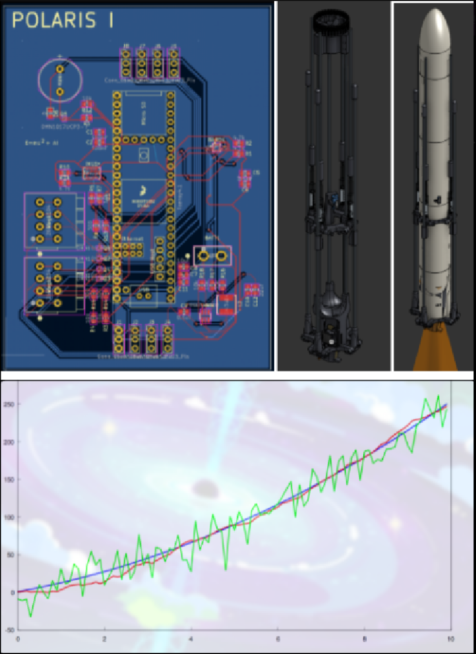
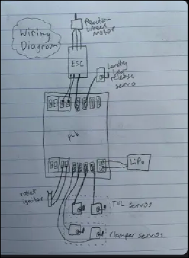
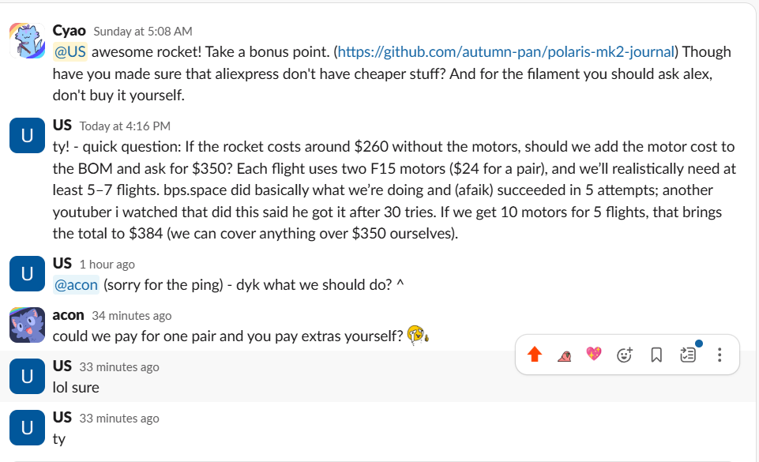

# Lepton Rocket
The Lepton Rocket is a TVC rocket that is capable of guiding itself using its thruster, as well as vertical landing using a second thruster. It requires no parachute or fins and is capable of self-stabilization using only gimballed motors and lands propulsively.

# Motivation
Our motivation for building this rocket stems from a deep passion for model rocketry and a will to learn and improve through this project. Building such a complicated rocket not only helps us learn and grow as people but also pushes technological boundaries we face today with innovative new solutions. Every step, from Kalman filters to thrust vectoring, offers unique challenges that serve as learning experiences. We hope that our work will go on to support other aspiring rocketeers through open sourcing and tutorials. Moreover, we are testing new methods of reversing exhaust jets and are testing materials in extreme environments. We hope that this research will inspire other projects that can make a real impact.

# Design

PCB

WIRING

CAD

# CAD Files
View the CAD files in ./cad, or preferably in the onshape document
[Link](https://cad.onshape.com/documents/b936ec593d2f13f8b4301d6a/w/959d82f8ce1a388125efc6ac/e/d0e27454aa34d56363c8f698)
# BOM -- Total Cost: $291.43, $310.37 after tax
| Name                          | Cost   | Link                                                                                                                                                                                                                                                                                                                                                      | Purpose                                           |
|-------------------------------|--------|------------------------------------------------------------------------------------------------------------------------------------------------------------------------------------------------------------------------------------------------------------------------------------------------------------------------------------------------------------|---------------------------------------------------|
| Teensy 4.1                    | 35.49  | [Link](https://www.amazon.com/PJRC-Cortex-M7-Processor-iMXRT1062-Without/dp/B088JY7P2H/ref=asc_df_B088JY7P2H?mcid=8ae789eb80d63b429a8b6233ef5751e7&hvocijid=17548775748303405856-B088JY7P2H-&hvexpln=73&tag=hyprod-20&linkCode=df0&hvadid=730312820598&hvpos=&hvnetw=g&hvrand=17548775748303405856&hvpone=&hvptwo=&hvqmt=&hvdev=c&hvdvcmdl=&hvlocint=&hvlocphy=9001697&hvtargid=pla-2281435177898&psc=1) | Processing information and running code          |
| Bosch Sensortec BMI088                        | 5.23   | [Link](https://www.digikey.com/en/products/detail/bosch-sensortec/BMI088/8634936)                                                                                                                                                                                                                                 | Reading inertial data                            |
| Bosch Sensortec BMP390                        | 3.15   | [Link](https://www.digikey.com/en/products/detail/bosch-sensortec/BMP390/16164577)                                                                                                                                                                                                                               | Reading altitude                                 |
| 2 WAGOs  (2601-1104)                     | 8.72   | [Link](https://www.digikey.com/en/products/detail/wago-corporation/2601-1104/17123797?gQT=1)                                                                                                                                                                                                                     | Connecting pyro channels                         |
| XT30U connector                        | 0.72   | [Link](https://www.tme.eu/en/details/xt30upb-m/dc-power-connectors/amass/?utm_source=octopart.com&utm_medium=cpc&utm_campaign=compare-2025-05-27)                                                                                                                                                                 | Connecting the battery                           |
| 8x Servo Pins    (G800W305018EU)         | 7.84   | [Link](https://www.digikey.com/en/products/detail/amphenol-icc-commercial-products-/G800W305018EU/13683151?gQT=1)                                                                                                                                                                                                 | Connecting the servo pins                        |
| 5x DMN1019UVT-7                     | 4.10   | [Link](https://www.digikey.com/en/products/detail/diodes-incorporated/DMN1019UVT-7/5126835)                                                                                                                                                                                                                       | Controlling pyro channels                        |
| Printed Circuit Board         | 50.00  | [Link](https://jlcpcb.com/)                                                                                                                                                                                                                                                                                       | Mounting flight computer devices on. We only ask that you pay for printing, shipping, and taxes on the raw circuit boards. We will try to fund the resistors, capacitors, etc. ourselves             |
| 3ml Syringes                  | 2.93  | [Link](https://www.aliexpress.us/item/3256806328171497.html?spm=a2g0o.productlist.main.1.413b734d9NaMbA&aem_p4p_detail=2025073016395111874069278487360002035883&algo_pvid=8ce5ca76-1fcf-42fd-9431-eb7cfd16bba9&algo_exp_id=8ce5ca76-1fcf-42fd-9431-eb7cfd16bba9-0&pdp_ext_f=%7B%22order%22%3A%22832%22%2C%22eval%22%3A%221%22%7D&pdp_npi=4%40dis!USD!2.60!2.60!!!18.56!18.56!%40210313e917539187916456686eafd5!12000037489056984!sea!US!0!ABX&curPageLogUid=oJgz2mSzbKY4&utparam-url=scene%3Asearch%7Cquery_from%3A&search_p4p_id=2025073016395111874069278487360002035883_1)                                                                                                                                                                                                                                                                        | Dampening landing legs                           |
| Brushless Motor               | 0.99   | [Link](https://www.aliexpress.us/item/3256806626806030.html?)                                                                                                                                                                                                                                                     | Driving the reaction wheel                       |
| Extension Cable               | 5.99   | [Link](https://www.amazon.com/FLY-RC-Connector-Extension-Brushless/dp/B0B12CFKNZ/ref=asc_df_B0B12CFKNZ?mcid=8e5db81149053e17aedeaeb54fc6da1f&hvocijid=2611908650921179939-B0B12CFKNZ-&hvexpln=73&tag=hyprod-20&linkCode=df0&hvadid=721245378154&hvpos=&hvnetw=g&hvrand=2611908650921179939&hvpone=&hvptwo=&hvqmt=&hvdev=c&hvdvcmdl=&hvlocint=&hvlocphy=9001697&hvtargid=pla-2281435177618&th=1) | Connecting the motor to the flight computer      |
| Set Screws 50pc 2cm 5mm       | 1.38   | [Link](https://www.aliexpress.us/item/2251832795980382.html?spm=a2g0o.productlist.main.11.4816cYVfcYVfrL&algo_pvid=4b71b07a-a4f2-45ce-9069-14c906ecce58&algo_exp_id=4b71b07a-a4f2-45ce-9069-14c906ecce58-10&pdp_ext_f=%7B%22order%22%3A%22403%22%2C%22eval%22%3A%221%22%7D&pdp_npi=4%40dis%21USD%211.35%211.15%21%21%211.35%211.15%21%402101ea8c17477554416392859edc7d%2166712359808%21sea%21US%210%21ABX&curPageLogUid=z28QujZoM2cn&utparam-url=scene%3Asearch%7Cquery_from%3A) | Weighing down the reaction wheel                |
| 1/4 acetyl copolymer rods-- 4 3ft rods and 8 2ft rods| 36.91 | https://buyplastic.com/delrin-acetal-copolymer-plastic-rod/ | Landing legs and supporting the fuselage
|2 servos bms127wv+| 54.97|[link](https://www.redwingrc.com/product.php?productid=2746)| Pricy, but very necessary due to the high forces that they will be subjected to. These are for tvc
| 2 servos PTK 7462W MG| 19.44 | https://www.aliexpress.us/item/3256807624830309.html? | Thrust reversal system
| TSP563200DDCR | 0.90 | https://www.digikey.com/en/products/detail/texas-instruments/TPS563200DDCR/5034343 | converting the battery to a lower voltage for the teensy to handle
| 5x 300 Ohm Resistor RC0402JR-07300RL| 0.50 | https://www.digikey.com/en/products/detail/yageo/RC0402JR-07300RL/726461 | Managing MOSFET gates
| 7x 10k Ohm Resistor RC0402JR-0710KL| 0.70 | https://www.digikey.com/en/products/detail/yageo/RC0402JR-0710KL/726418 | Pull down resistors for MOSFETS
| 4x 4.7k Ohm Resistor RC0402JR-074K7L | 0.50 | https://www.digikey.com/en/products/detail/yageo/RC0402JR-074K7L/726477 | Sensor stack pull down resistors
| 1x 55k Ohm Resistor ERA-2AEB563X| 0.10 | https://www.digikey.com/en/products/detail/panasonic-electronic-components/ERA-2AEB563X/1706047 | Managing TSP563200 output voltage
| 7x 0.1 uF Capacitor CL05B104KP5NNNC | 0.56 | https://www.digikey.com/en/products/detail/samsung-electro-mechanics/CL05B104KP5NNNC/3886660 | smoothing voltage
| 2x 22 uF Capacitor | 0.05 | https://www.digikey.com/en/products/detail/murata-electronics/GRM188R61A226ME15D/5027561 | Smoothing voltage with the TSP
| F15-0 Estes Rocket Motor| 22.95 | https://fusionscalehobbies.com/products/estes-f15-0-29mm-engines-2pk?variant=44043735826688&country=US&currency=USD&utm_medium=product_sync&utm_source=google&utm_content=sag_organic&utm_campaign=sag_organic&utm_campaign=gs-2022-04-29&utm_source=google&utm_medium=smart_campaign&gad_source=1&gad_campaignid=17519716778&gbraid=0AAAAAoZqEGAQWxo04MMDcF5MdhRO7ZtAf&gclid=Cj0KCQjwhafEBhCcARIsAEGZEKLQsLOV6peTK6vGFhD8sOgo2fjzVBQZQKSE6nMh4wYBtARwmmqMCWkaAuOZEALw_wcB | Launching the rocket |
|Solder paste | 4.36 | https://www.aliexpress.us/item/3256809207808464.html? | soldering SMDs to the PCB |
| Threaded inserts | 1.73 | https://www.aliexpress.us/item/3256803396040989.html? | TVC assembly |
| Bearings | 6.26 | https://www.aliexpress.us/item/3256802138888272.html? | TVC Assembly |
| 5x Threaded acrew | 7.05 | https://www.aliexpress.us/item/3256806603708402.html? | General connections |
| Insert Nuts | 4.98 | https://www.aliexpress.us/item/3256808011211144.html? | General connections |

Notes on our vendors:
- Teensy 4.1 is necessary for its high speed, reliability, and ease of use. It is necessary for advanced avionics like this project. However, it's difficult to optimize the price of, and the cheapest price from a trusted vendor was about $31. Considering free shipping however, the cheapest vendor was on Amazon and was $35. Aliexpress was thoroughly considered and while vendors there were considered, they were found to be misleading and/or untrustworthy. A bad MPU is not only a waste of money and time, but can also be a violation of safety guidelines.
- The acetyl copolymer rods are the cheapest and most reliable on the market for what they are-- we thoroughly checked. Aliexpress does not offer any rod long enough to support this rocket, and has insufficient quality assurance which could compromise the safety of this project. Also note that this is including shipping for a large object, which is absolutely necessary in this case. Alternative rocket bodies can cost upwards of $90 at this size, so this really is the cheapest possible. Furthermore, we considered carbon fiber rods from aliexpress, however we were not allowed to purchase them in the quantity that we needed, and even the cheapest rods from Aliexpress did not make a significant difference. We really optimized the rods and rocket body to the extreme.
- We looked on Aliexpress for banana extender cables, but all options were either more expensive or significantly too short for what we needed. The one on amazon is the cheapest one that works.
- The servos we found are the only servos strong enough that can fit inside the rocket. Any larger servos could introduce significant problems during flight. These are also necessary because it is for a guidance system, and therefore needs to be fast and respond quickly. We found the cheapest servos possible.
- The servos for thrust reversing can be cheaper, so we got the cheapest servos from Aliexpress that are still strong enough to do their job. This cut costs by upwards of $40. The servos could not be cheaper than this.
- We were promised that Hack Club would supply one pack of Estes F15-0 motors by Acon

