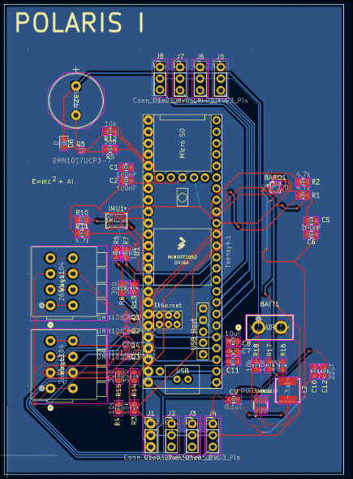

# Lepton Rocket
The Lepton Rocket is a TVC rocket that is capable of guiding itself using its thruster, as well as vertical landing using a second thruster. It requires no parachute or fins and is capable of self-stabilization using only gimballed motors and lands propulsively.

# Motivation
Our motivation for building this rocket stems from a deep passion for model rocketry and a will to learn and improve through this project. Building such a complicated rocket not only helps us learn and grow as people but also pushes technological boundaries we face today with innovative new solutions. Every step, from Kalman filters to thrust vectoring, offers unique challenges that serve as learning experiences. We hope that our work will go on to support other aspiring rocketeers through open sourcing and tutorials. Moreover, we are testing new methods of reversing exhaust jets and are testing materials in extreme environments. We hope that this research will inspire other projects that can make a real impact.

# Design
PCB

